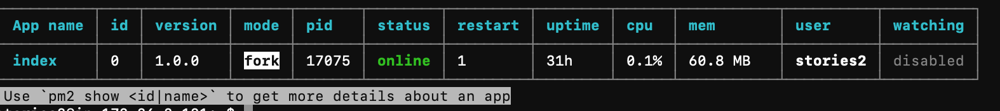

# Gemsung-Server

영상 제작 요청 정보를 클라이언트가 업로드 하고 실제 영상 제작 요청을 `AWS` 서버에 전달하는 트리거


## Getting Started

### Prerequisites

- Node.js `v10.16.3 LTS`
- ~~Heroku cli~~
- ffmpeg `4.1.3-0york1~16.04`
- Ubuntu `16.04`
- Nignx `nginx/1.10.3 (Ubuntu)`
- PM2 `3.5.1`

### Installing

- 서버 프로그램 클론

```
git clone https://github.com/OpenSW-Team-CONO/GemSung-Server.git
cd GemSung-Server
npm install
```

> .env 파일은 보안상 생략

- nginx 서버 설정

```
sudo vim /etc/nginx/sites-available/default


        location / {
                # First attempt to serve request as file, then
                # as directory, then fall back to displaying a 404.
#               try_files $uri $uri/ =404;

                proxy_pass http://127.0.0.1:5000;
                proxy_http_version 1.1;
                   proxy_set_header Upgrade $http_upgrade;
           proxy_set_header Connection 'upgrade';
           proxy_set_header Host $host;
proxy_connect_timeout 300;
proxy_send_timeout 300;
proxy_read_timeout 300;
send_timeout 300;
        }
```

## Deployment

```
pm2 start index.js
```



## License

MIT [LICENSE.md](LICENSE)